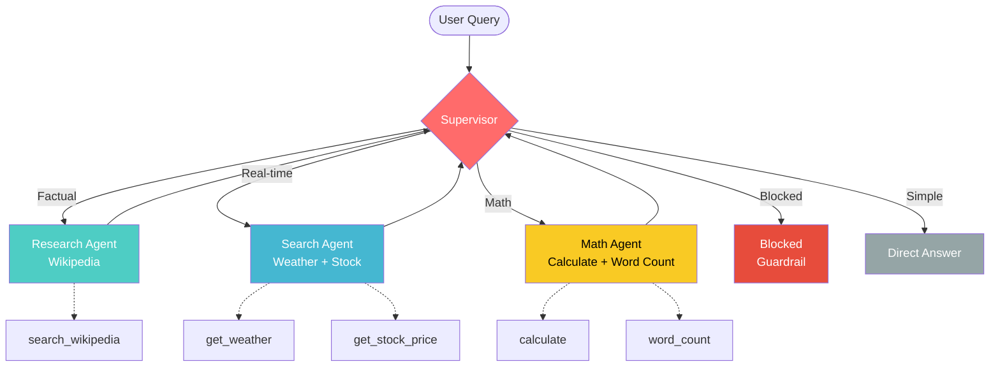

# Multi-Agent System

A Multi-Agent System built with LangGraph + LangChain + Ollama, featuring a Supervisor Pattern with specialist sub-agents and guardrails.

## Features

- 🎯 **Supervisor Pattern** - Central routing based on query type
- 📚 **Research Agent** - Wikipedia search for facts & history
- 🔍 **Search Agent** - Weather (Open-Meteo) & Stock (yfinance)
- 🧮 **Math Agent** - Calculator & Word Count
- 🛡️ **Guardrails** - PII detection & content filtering
- 📊 **Feedback Loop** - User rating (1-10) for continuous improvement
- 🏠 **100% Local** - Runs on Ollama (no API key needed)

## Architecture




## Tech Stack

- **LangGraph** - Multi-Agent orchestration
- **LangChain** - Agent framework
- **Ollama** - Local LLM (llama3.2:3b)
- **FastAPI-ready** - Can be wrapped as API

## Installation

```bash
# Clone the repo
git clone https://github.com/anderhong/multi-agent-system.git
cd multi-agent-system

# Install dependencies
uv sync

# Pull LLM model (first time only)
ollama pull llama3.2:3b

# Run the agent
uv run python my_agent.py

## Usage
==================================================
Multi-Agent System 已啟動！
輸入 'bye' 或 'exit' 結束對話。
==================================================

你: who won the 2026 World Cup?
🎯 [Supervisor] 決定派去 → search_agent（即時資訊）
🔍 [Search Agent] 開始處理...
Agent: Spain won the 2026 FIFA World Cup...

📝 Rate this response (1-10), or press Enter to skip:
   Rating: 9
✅ Feedback recorded: 9/10